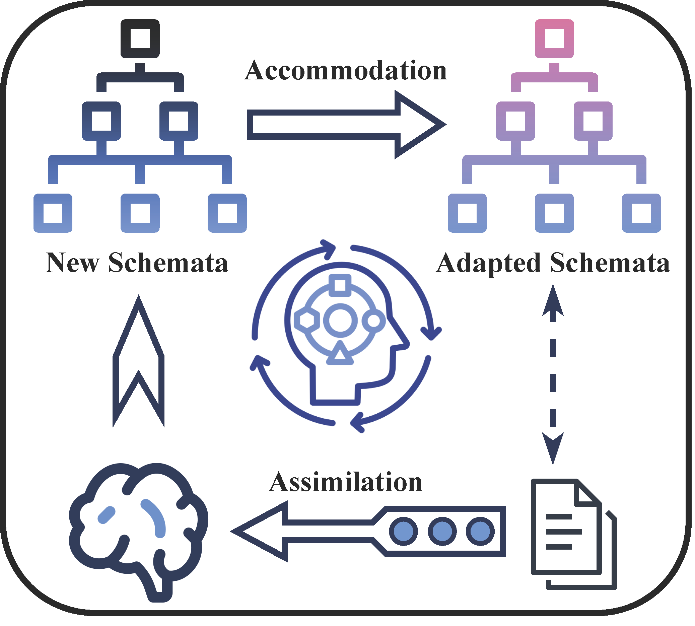
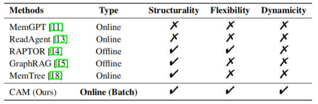
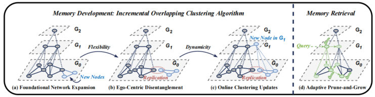
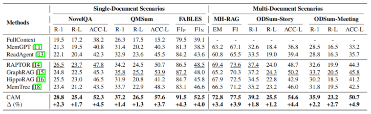
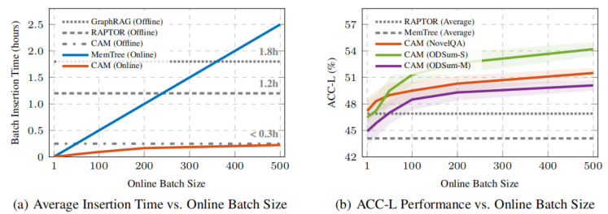
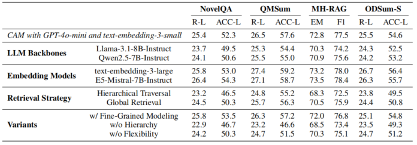

## CAM: A Constructivist View of Agentic Memory for LLM-Based Reading Comprehension

### Introduction

#### Limitation & Research Question
当面对极长的文档时
- LLM 有限的上下文容量
- 难以感知和聚合分散在冗长文本中相距甚远的关键信息片段

为 LLM 配备显式记忆模块以进行信息存储和检索。
- 存储、检索
- 对长程依赖关系进行推理

然而，尽管最近出现了大量的智能体记忆方法，但它们通常只是在表面层次上模仿人类记忆，缺乏连贯的原则作为其设计基础。
- 关键问题：对于基于 LLM 的阅读智能体而言，一个有效的记忆模块应具备哪些特征？

#### Jean Piaget's Constructivist Theory
让·皮亚杰的建构主义理论是认知科学的基石，深刻影响了对人类记忆如何发展的理解。

皮亚杰提出认知发展过程或建构过程有四个核心概念：

- 图式 (schemas)：将知识形像化，成为一个概念模型。知识可以透过同化或顺化来达成。
- 同化 (assimilating)：将新知识和旧有知识类比，并作出关连。
- 顺化 (accommodating)：将旧知识的概念模型改变调适，以容纳新的内容。
- 平衡 (equilibrium)
这种形像化过程不会完全只有同化或顺化的过程，而是两者之间的一个平衡点。找出这个平衡点的过程就是平衡。平衡有三种：

    - 第一种平衡是同化和顺化之间的联系。
    - 第二种平衡是基模与基模之间的平衡。
    - 第三种平衡是一种调节个体部分知识与整体知识之间关系的平衡。

该理论认为记忆是指一个不断发展的心理系统，它主动将接收到的信息组织成连贯的认知结构图式。当新信息到来时，两个基本操作驱动图式的发展过程：（1）同化，将新信息融入当前的记忆图式；（2）顺应，如果新信息无法轻易融合，则改变当前的图式结构。这两个操作共同维持了记忆图式的认知平衡，这是一种平衡的增长状态，有助于对接收到的信息进行更准确的心理表征。

值得注意的是，同化表现出**灵活性**，允许每个信息单元被整合到图式中的多个相关位置；顺应表现出**动态性**，使图式能够通过局部调整进行演变，而无需在每次输入时进行大规模重建。

#### Contribution
然而，当前的智能体记忆系统在本质上偏离了这一设计原则。

为此，我们提出了 CAM，即建构主义智能体记忆（Constructivist Agentic Memory）的原型，旨在增强 LLM 的长文本阅读理解能力。在记忆结构性方面，CAM 主动将输入文档组织成统一的层次架构。

- 在基础层，CAM 构建了一个由原始文本块形成的连贯语义网络，捕捉文本相似性和叙事连贯性。
- 更高层的记忆节点是从密切相关的低层节点聚合而成的抽象摘要。
- 在构建此层次结构的过程中，CAM 被赋予了一种局部优先的增量重叠聚类算法，以支持灵活同化（即，一个低层记忆节点可以有助于多个高层抽象）和动态顺应（即，记忆结构能有效地适应新输入）。

值得注意的是，我们的设计自然地允许 CAM **批量集成**新到达的文本块，与仍局限于离线或逐条在线设置的现有方法相比，提供了显著的效率优势。在推理时，CAM 采用 Prune-and-Grow 联想策略来激活与查询相关的记忆节点以进行上下文响应，在各种长文本阅读任务中实现了高准确性。

本文的贡献总结如下：
* **Blueprint**：借鉴皮亚杰的建构主义理论，为基于 LLM 的阅读理解中的智能体记忆提出了明确的设计原则（结构化图式、灵活同化和动态顺应）。
* **Prototype**：然后，我们开发了建构主义智能体记忆（CAM）的原型，以增强 LLM 的阅读理解能力，使用增量重叠聚类算法进行记忆开发，并使用 Prune-and-Grow 策略进行记忆检索。
* **Evaluation**：我们在问答、基于查询的摘要和主张验证基准上评估了我们的设计，涵盖了单文档和多文档场景。结果表明，CAM 在性能和效率上均优于现有方法。

### Blueprint: Structurality, Flexibility, and Dynamicity

#### Structured Schemata

根据皮亚杰的建构主义理论，记忆系统应主动将所有接收到的信息自底向上重构为分层的图式。

形式上，给定一组输入信息单元（例如，原始文本块）$V=\{v_{1},v_{2},...,v_{n}\}$，记忆首先感知这些基本单元之间的潜在关联，以构建基础语义网络 $G_{0}=(V,E)$，其中 E 是捕捉单元节点语义连贯性的边集。

然后，密切相关的单元被聚合成更高层次的超节点，形成一个代表抽象理解的粗粒度网络。抽象的进一步聚合递归地构建了这样一个记忆图式层次结构：

$$
M=(\{G_{l}\}_{l=0}^{L},\{\psi_{l}\}_{l=1}^{L}) \tag{1}
$$

其中 $G_{l}=(V_{l},E_{l})$ 表示第 $l$ 层的图，$V_{L}$ 和 $E_{l}$ 分别是节点集和边集；$\psi_{l}:G_{l-1}\rightarrow G_{l}$ 是向上的映射，反映了 $G_{l-1}$ 中的低层元素对 $G_{l}$ 中高层抽象的隶属关系。这种层次结构性自然地实现了抽象概念和粒度细节的无缝集成，利于复杂信息的深度理解和准确回忆。

$M$ 的构建由两个主要的认知过程驱动：同化和顺应。它们构成了信息如何并入记忆结构以及结构如何适应以确保连贯性的基础。

#### Flexible Assimilation

同化是指将信息融入记忆图式而不大幅改变其结构的过程。

形式上，给定一批新的信息单元 $V_{new}=\{v_{n+1},...,v_{n+m}\}$，记忆系统首先将这些单元组织到基础语义网络 $G_{0}$ 中，将其更新为 $G_{0}^{\prime}=(V\cup V_{new},E\cup E_{new})$，其中 $E_{new}$ 是新单元与当前节点之间以及新单元相互之间的关联边集。

在 $G_{0}^{\prime}$ 之上，同化的下一个关键步骤是建立每个新添加节点 $v_{new}\in V_{new}$ 的层次隶属关系。具体来说，记忆系统通过确定向上映射 $\psi_{1}(v_{new})$，将 $v_{new}$ 与 $G_{1}$ 中的高层抽象相关联。这种映射既可以将每个节点分配给现有的抽象（即 $\psi_{1}(v_{new})\subseteq V_{1}$）以丰富其语义范围，也可以在 $G_{1}$ 中创建全新的抽象节点，以触发更高层记忆的进一步同化。

同化的关键特征在于其灵活性，允许每个低层信息单元同时丰富多个高层抽象，即 $\psi_{l}$ 应该是一个多对多映射。通过启用这种重叠的隶属关系，记忆图式可以捕捉复杂输入信息的多面性，其中单个单元可能与多个主题、话题或概念相关。

#### Dynamic Accommodation

在同化过程中，随着新节点和边的整合，记忆图式逐渐扩展。然而，这种扩展可能会使记忆层次结构变得次优或与更新后的上下文不一致。例如，一个抽象节点可能会变得过载，从而损害其表示下属单元的有效性。

顺应涉及改变层次结构中受影响的部分，重新分配下属单元并重新校准抽象节点，以恢复结构连贯性和认知平衡。这种动态过程维持了平衡的记忆图式，无需全局重构即可有效地适应新信息。这种能力确保了可扩展性和效率，因为记忆系统可以以连续、在线的方式适应新输入。

### Prototype: Constructivist Agentic Memory

基于上述蓝图，我们随后开发了建构主义智能体记忆（CAM）的原型，用于基于 LLM 的长篇文档阅读理解。此框架如图所示。

#### Memory Development

在阅读阶段，CAM 需要在连贯的层次结构中灵活地同化和动态地顺应输入文本。

技术实现借鉴了两个观察结果：
- 灵活同化与重叠聚类非常吻合，其中密切相关的记忆节点形成簇，且每个节点可属于多个簇。
- 动态顺应对应于增量聚类，其中簇结构随新输入而演变。

这两个认知过程是相互交织而非独立的，这表明集成这两种功能的紧凑、统一的算法设计将是更优的选择。因此，赋予 CAM 一种增量重叠聚类算法用于记忆开发，确保了简单性和效率。具体而言，过程包括三个主要步骤：

1.  **基础网络扩展**：新的文本块 $V_{new}$ 被整合到基础语义网络 $G_{0}=(V,E)$（初始为空）中，基于文本相关性和叙事连贯性建立新的边 $E_{new}$。
2.  **以自我为中心的解缠**：对于受影响的节点 $A$（新节点及其邻居节点），CAM 分析它们的局部结构以更新 $G_{0}$ 的副本网络 $\tilde{G}_{0}$（初始为空），该网络通过节点复制显式地解缠重叠的簇。
3.  **在线聚类更新**：在非重叠副本网络 $\tilde{G}_{0}$ 上，应用增量标签传播算法来修改簇分配。对于修改后的簇，CAM 随后使用 LLM 更新抽象节点，受影响的超节点在下一层进一步触发此过程（Step 2 和 Step 3）。

##### Foundational Network Expansion

给定 m 个新的连续文本块 $V_{new}=\{v_{n+1},v_{n+2},...,v_{n+m}\}$，CAM 首先将这些信息单元并入基础语义网络 $G_{0}=(V,E)$。

为了捕捉接收到的块之间的文本相关性和叙事连贯性，我们定义了一个综合得分函数，整合了语义相似度和位置接近度。形式上，对于每一对块 $v_{i}\in V_{new}$ 和 $v_{j}\in V\cup V_{new}$，语义相似度计算为由预训练模型 $f_{emb}(\cdot)$ 生成的嵌入之间的余弦相似度。

此外，使用高斯相似度测量 $v_{i}$ 和 $v_{j}$ 之间的位置接近度，该相似度为位置更近的块分配更高的分数。

结合这两个方面，整体相似度得分定义为它们的线性插值：

$$
s(v_{i},v_{j})=\alpha\cdot\frac{f_{emb}(v_{i})\cdot f_{emb}(v_{j})}{||f_{emb}(v_{i})|||f_{emb}(v_{j})||}+(1-\alpha)\cdot exp(-\frac{(i-j)^{2}}{2\sigma^{2}}) \tag{2}
$$

其中 $\alpha\in[0,1]$ 是加权系数，$i$ 和 $j$ 分别是 $v_{i}$ 和 $v_{j}$ 的位置索引，$\sigma$ 控制接近度影响的衰减率。对于每个接收到的块，识别出相似度得分超过预定义阈值 $\gamma$ 的前 k 个相关节点，然后在它们之间建立新的边，以形成扩展的基础图 $G_{0}^{\prime}=(V^{\prime},E^{\prime})=(V\cup V_{new},E\cup E_{new})$。

##### Ego-Centric Disentanglement

记忆同化允许每个低层单元同时有助于多个高层抽象。CAM 通过一种以自我为中心的解缠策略实现这种灵活性，该策略通过基于节点的局部结构复制节点来分离每个节点的贡献。

1. 提取 Ego-Network：对于 $G_{0}$ 中的每个节点 $v\in V$，CAM 首先提取其自我网络 $G_{0}[\mathcal{N}(v)]$，这是由 $v$ 的邻居节点及其之间的边组成的子图（不包含 $v$）。

2. 发现连通分量：将 $G_{0}[\mathcal{N}(v)]$ 划分为互不相连的连通分量 $\{C_{v}^{1},C_{v}^{2},...,C_{v}^{t_{v}}\}$，其中 $t_{v}$ 表示 $v$ 的自我网络中连通分量的数量。这些连通分量反映了节点 $v$ 充当连接原本不相关连通分量的局部割点。

3. 节点复制：创建了 $v$ 的 $t_{v}$ 个副本，表示为 $\{v^{1},v^{2},...,v^{t_{v}}\}$，每个副本专门与一个连通分量相关联。

4. 构建副本网络 $\tilde{G_0}$： 设 $\tilde{V}$ 表示 $G_{0}$ 中所有节点的副本集合，每条原始边也被映射到其端点副本之间的连接：如果 $(u,v)\in E$，$u\in C_{v}^{j}$，且 $v\in C_{u}^{i}$，则将一条边 $(u_{i},v_{j})$ 添加到 $\tilde{E}$。所得网络 $\tilde{G}_{0}=(\tilde{V},\tilde{E})$ 通过节点复制有效地解缠了重叠结构，从而允许信息即使使用简单的非重叠聚类算法也能被总结成多个抽象。

当一组新节点 $V_{new}$ 和相应的边 $E_{new}$ 被整合到 $G_{0}$ 中时，CAM 只需要构建或更新受影响节点 $A=V_{new}\cup\{u\in V|\exists v\in V_{new},(u,v)\in E_{new}\}$ 的副本，而无需全面重建。此外，由于所有节点仅关注各自的自我网络，因此多个节点的复制本质上是可并行化的。

##### Online Clustering Updates

在副本网络 $\tilde{G}_{0}$ 上，CAM 随后采用增量标签传播算法进行在线聚类更新。此过程在 $G_{0}$ 的子图上局部运行，从而能够高效地适应新接收的信息。

1. 确定影响范围：当一组副本被同化到 $\tilde{G}_{0}$ 中时，CAM 首先跟踪所有受影响的节点 $\tilde{A}$，包括新添加的副本和其邻域已更改的现有副本。

2. 标签传播：
    - 新的副本节点被初始化为唯一的簇标签，而现有的副本节点保留其先前的标签。
    - CAM 在 $\tilde{A}$ 的诱导子图中执行标签传播，其中每个节点 $v\in\tilde{A}$ 的标签根据其邻居 $\mathcal{N}(v)$ 中的多数标签进行迭代更新。
    - 如果现有节点的簇标签发生变化，其所有邻居都将被添加到 $\tilde{A}$ 以进行下一轮更新，确保充分捕捉潜在的连锁反应。
    - 此过程递归继续，直到没有进一步的标签更改发生或达到预定义的迭代限制。

3. 生成高层抽象：当聚类过程收敛后，CAM 将聚合每个修改后的簇中的节点，以更新它们在下一记忆层中对应的抽象节点。这种聚合通过基于 LLM 的文本摘要将紧密连接的文本块转换为紧凑、连贯的摘要。所得的超节点及其簇间连接随后作为新节点和边并入更高层的记忆网络，触发记忆层次结构的进一步构建。

**4.2 记忆检索**

一旦记忆结构构建完成，阅读智能体的另一个关键问题是如何响应用户查询从记忆中检索相关信息。

现有方法通常采用两种常见策略：层次遍历和全局检索。
- 层次遍历仅将输入查询与每个记忆层中的一部分节点进行比较，容易遗漏相关信息，尤其是在较低层。
- 全局检索虽然可以在所有节点之间进行比较，但仅依赖于一次性语义匹配，而忽略了相关的记忆结构。

在这项工作中，CAM 采用 Prune-and-Grow 联想检索策略，该策略首先从全局视角快速定位与查询相关的线索，然后沿着记忆结构进行递归联想。具体而言，我们的策略分为两个阶段：

1.  **快速定位**：对于输入查询 q，CAM 首先计算查询嵌入 $f_{emb}(q)$ 与每个记忆节点嵌入 $f_{emb}(v)$ 之间的余弦相似度。选择具有最高相似度得分的前 s 个节点形成候选集 D。此阶段反映了人类在回忆过程中快速查明相关记忆片段的认知过程。
2.  **联想探索**：CAM 使用 LLM 从 D 中选择有助于回答查询的节点，形成激活集 $P\subseteq D$。随后，收集所有已激活节点的**同层邻居**和**下层子节点**到一个新的候选集中，LLM 从中继续选择潜在有用的节点以扩展激活集 P。此过程重复进行，直到 P 不再增长或达到最大迭代次数。最后，所有被激活的节点都被输入 LLM 进行推理，类似于人类的联想思维。

这种 Prune-and-Grow 工作流结合了全局语义匹配和局部结构探索，使 LLM 能够自适应地收集与查询相关的记忆作为上下文推理的支持。

### Experiments

#### Experimental Setup

* **Datasets**
    - 单文档场景：NovelQA (Question Answering)、QMSum (Query-based Summarization) 和 FABLES (Claim Verification)
    - 多文档场景，MultiHop-RAG (Question Answering)、ODSum-Story (Query-based Summarization) 和 ODSum-Meeting (Query-based Summarization)。

* **Baselines**
    - 非结构化记忆：FullContext、MemGPT 和 ReadAgent
    - 结构化记忆：RAPTOR、GraphRAG、HippoRAG 和 MemTree

* **Metrics**
    - 自由形式的数据集 (NovelQA, QMSum, ODSum)：用于词汇相似度的 ROUGE F-Measures 和来自 GPT-4o 的 LLM-as-a-judge 准确率 (ACC-L)
    - MultiHop-RAG (MH-RAG)：精确匹配 (EM) 和 F1 分数
    - FABLES：正标签和负标签的 F1 分数，即 $F1_{P}$ 和 $F1_{N}$。

除非另有说明，使用 GPT-4o-mini 作为 LLM backbone，并使用 text-embedding-3-small 作为嵌入模型 $f_{emb}$。

#### Offline Performance Comparison

下表展示了六个阅读理解基准的主要结果。可以观察到，CAM 在这些数据集的所有指标上始终优于基线。这些结果在结构性和灵活性方面与建构主义设计原则非常吻合。

* **Memory Structurality**
    - 结构化记忆方法（例如 RAPTOR、GraphRAG 和 CAM）表现出明显强于那些没有显式结构的方法（例如 ReadAgent 和 MemGPT）的性能，证实了记忆结构性在阅读理解任务中的重要性。
    - 层次结构对于摘要数据集（QMSum 和 ODSum）特别有效，RAPTOR、GraphRAG 和 MemTree 优于非层次化的 HippoRAG 的结果证明了这一点。
    - 值得注意的是，与 RAPTOR 相比，GraphRAG 和 HippoRAG 中 LLM 驱动的**知识图谱建模并没有带来一致的增益**，这可能是因为难以从以叙事为中心的文本中提取信息丰富的实体。

* **Assimilation Flexibility**
    - 尽管都采用了树状记忆结构和全局检索，RAPTOR 在所有数据集上始终优于 MemTree（所有指标平均 2.1%）。
        - RAPTOR 允许节点到摘要多对多映射
        - MemTree 强制执行严格的层次包含
    - 这一比较证实了灵活同化对于有效的长文本理解至关重要。

* **Memory Retrieval**
    - RAPTOR 和 GraphRAG 在不同任务上的性能差异，强调了记忆检索策略对整体性能的影响。
        - RAPTOR 的全局检索适用于问答
        - GraphRAG 集成所有记忆节点进行响应，使其在综合摘要任务中更具优势

* **CAM’s Holistic Advantages**
    - CAM 在所有数据集上始终实现卓越的性能，与最佳基线（RAPTOR 和 GraphRAG）相比，所有指标平均提高了 3.0%。

#### Dynamicity of CAM: From Offline to Online

现实世界的应用场景通常需要记忆系统在保持稳定性的同时分批次连续集成新文本。现有的离线方法（例如 RAPTOR 和 GraphRAG）本质上要求每次更新都进行全面的记忆重建。MemTree 虽然是在线的，但仅允许顺序的、逐块的集成。与它们不同，CAM 自然地支持批次级同化和局部优先顺应，从而确保在线记忆开发的各种处理效率和推理稳定性。

* **Processing Efficiency** 图 (a) 显示了不同记忆方法对新一批文本块（每个块包含 512 个 token）的平均集成时间。
    - 离线 RAPTOR 和 GraphRAG 需要超过 1 小时来重建整个记忆，使其不适合实时使用。
    - 由于其顺序处理的性质，MemTree 的时间随批次大小线性增加，当新批次超过 400 个块时，甚至比离线重建还要慢。
    - 相比之下，CAM 基于其可并行化的同化和局部化顺应过程，在所有批次大小下都保持高效集成。随着批次大小的增加，CAM 的时间成本呈**次线性**增长，接近其离线水平（比 RAPTOR 和 GraphRAG 快 4 倍以上），其中 LLM 操作是主要开销。这种时间收敛是合理的，因为大批次需要大量的记忆调整。

* **Inference Stability** 图 (b) 说明了 CAM 在 NovelQA、ODSum-Story 和 ODSum-Meeting 上不同批次大小的 ACC-L 结果。在线 CAM 的性能在不同批次大小下保持相对稳定，并且继续与表 2 中的基线保持竞争力。这表明 CAM 能够有效地调整其记忆结构以适应新文本。

#### More Analysis: Configurations and Variants

* **LLM Backbones**
    - 为了评估 CAM 的性能是否依赖于像 GPT-4o-mini 这样的商业 LLM。
    - 如表所示，尽管 Llama-3.1-8B-Instruct 和 Qwen2.5-7B-Instruct 的参数规模相对较小，但与 GPT-4o-mini 版本相比仅略有下降。
    - 这表明 CAM 的核心优势主要源于有效的记忆设计，而不是依赖昂贵的 LLM 主干。

* **Embedding Models** 我们进一步研究了嵌入模型对 CAM 性能的影响。如表所示，使用更先进的嵌入模型可以提高 CAM 的性能，因为它们为记忆基础网络的构建提供了更准确的相似度测量。

* **Retrieval Strategies** 上表说明了 CAM 在不同记忆检索策略下的结果。我们观察到，使用层次遍历或全局检索都会导致性能下降，验证了我们 Prune-and-Grow 策略的有效性。

* **Performance by Question Type** 为了进一步调查 CAM 在不同问题特征下的表现，观察到 CAM 在处理复杂问题（例如多跳、时间和跨度类型）时表现出明显的优势，这些问题通常需要整合语义上相距甚远的证据并保持叙事连贯性。

* **Fine-Grained Foundational Modeling**
    - 最近的一些工作（例如 GraphRAG 和 HippoRAG）采用 LLM 从输入文本中构建知识图谱（即实体识别和关系提取）。这种细粒度的知识建模可以很容易地集成到 CAM 中，以构建更细粒度的基础网络。
    - 然而，由于大量的 LLM 调用，此过程将使计算成本增加三倍以上，但并未实现相应改进。我们观察到，即使是商业 LLM（GPT-4o-mini）也**难以从冗长的叙述中提取信息丰富的实体**。

* **Ablation Variants**
    - w/o Hierarchy: 完全省略了层次聚类，仅依赖基础语义网络进行推理
    - w/o Flexibility: 绕过了以自我为中心的解缠，直接应用标签传播进行层次聚类。
    - 两个变体都导致了明显的性能下降，从而证实了层次结构和灵活性在我们设计原则中的重要性。

### Limitations and Discussion

* **Beyond Reading Comprehension** 尽管我比较认同建构主义理论为认知发展提供的广泛见解，但他们的工作（Prototype）是专门针对长文本阅读理解任务，例如问答、基于查询的摘要和主张验证。将这种深刻的记忆设计原则扩展到其他领域，例如行为规划、长序列生成和多模态任务，仍未得到探索，但对于未来的研究具有巨大的潜力。

* **More Agentic Behaviors** 这项工作主要集中于描绘智能体记忆的关键特征，并开发了一个原型来验证这些特征的重要性。然而，额外的智能体行为，例如自我提问和反思，并未纳入我们的框架。集成这些能力对于推进更强大的基于 LLM 的智能体系统可能至关重要。

* **Hallucination Propagation** CAM 在记忆开发过程中利用 LLM 进行摘要，这带来了产生幻觉的风险——即生成不准确或捏造的信息。由于 CAM 生成分层摘要，低层节点中的错误或幻觉可能会传播到高层抽象，从而可能影响该框架在现实场景中的适用性。但这是个不可避免的问题，在智能体记忆中检测和减轻此类幻觉仍然是一个开放的挑战。

* **Inconsistent Information Sources** 检测和调和矛盾信息的能力是人类认知的一个关键方面。与之前的基于 LLM 的记忆系统（例如 GraphRAG、RAPTOR 和 MemTree）一致，我们的框架也假设源文本在内部是一致的。然而，现实世界的文档通常包含相互冲突的事实或观点，尤其是在复杂的开放领域设置中。解决这一挑战需要专门的努力，例如构建新的基准和设计评估协议来衡量调和能力。我们认为具备不一致性感知的记忆开发是未来研究的一个有前景的方向。

* **Alternative Implementations** CAM 使用局部优先的增量重叠聚类算法实例化了建构主义设计原则。虽然此实现满足了所需的属性（即结构化图式、灵活同化和动态顺应），但它并不是实现这些目标的唯一途径。其他策略（例如神经控制器和符号规划器）可能在可扩展性、可解释性和通用性方面提供不同的权衡。探索遵循建构主义原则的替代实现可以进一步丰富记忆系统的格局。

* **Learn to Memorize** 我们的 CAM 实现依赖于固定的提示和调整后的超参数，而不是用于记忆同化和顺应的自适应策略。它既不优化记忆结构，也不根据下游反馈调整其更新规则。向可训练的记忆控制器迈进（例如，学习更新什么或如何路由检索）可以进一步提高记忆开发的质量和效率。设计这样的机制在信用分配方面提出了不小的挑战，但标志着向更强大的智能体记忆系统迈出了关键一步。
